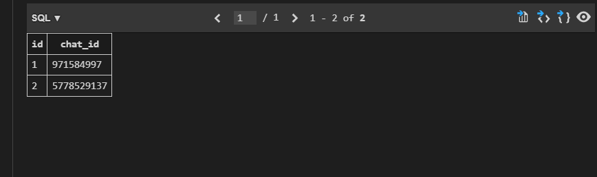
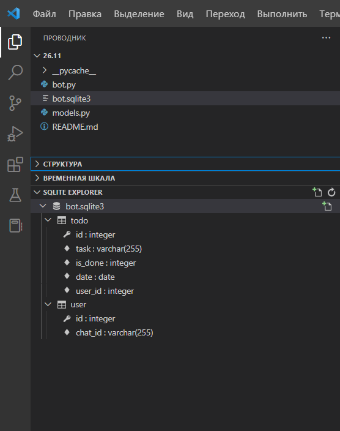

# Телеграм-бот "TODO list" (список дел)

*Что умеет бот?*

- Cоздавать задачи на текущий день
- Выводить список задач на текущий день
- Возможность пометить задачу как завершенную
- Отправлять напоминание о задачах каждый час, если есть незаконченные задачи

Для реализации текущих задач использовала 3 библиотеки:

1.   `peewee` (ORM библиотека) для взаимодействия с базой данных `SQLite` 
2.   `telebot`
3.    библиотека `schedule` для рассылки сообщений в установленное время

Необходимо настроить окружение -- ввести в консоле команды поочередно:

```python
pip install telebot
pip install PyTelegramBotAPI==2.2.3
pip install PyTelegramBotAPI==3.6.7
pip install schedule
pip install peewee

# вот так устанавливаем библиотеки 
```

Чтобы успешно использовать телеграм-бот, необходимо в 8 строке модуля bot.py добавить индивидуальный токен телеграм-бота (прилагаю [инструкцию](https://core.telegram.org/bots))

## Модуль `models.py`

В модуле создала место, куда буду сохранять задачи на текущий день. В качестве `ORM` использовала `peewee `. ORM (`peewee `) берет на себя преобразование питоновских объектов в значения, подходящие для базы данных и наоборот. 

В файле `models.py` описано несколько моделей для БД. По сути это 2 таблицы. 1я-модель пользователя (одно поле chat_id), 2я-модель - его todo, несколько полей (задача, закончена ли она, на какой день делается)

```python
from peewee import SqliteDatabase, Model, CharField, DateField, ForeignKeyField, BooleanField


db = SqliteDatabase('bot.sqlite3')  # создала БД


class User(Model):
    chat_id = CharField()   # создала первое поле

    class Meta:          # это управляющий класс, класс который управляет классом
        database = db  # модель будет использовать базу данных 'bot.sqlite3'


class Todo(Model):           
    task = CharField()                # первое поле задача
    is_done = BooleanField()         # закончена ли она
    date = DateField()               # на какой день делается
    user = ForeignKeyField(User)       # поле пользователь, задаю отношения между моделями через внешний ключ

    class Meta:
        database = db

# Модели описаны, осталось создать для них соответствующие таблицы в базе данных:
db.create_tables([User, Todo])   #   

# Записи можно создавать и напрямую с помощью метода Model.create() без явного save():
User.create(chat_id=message.chat.id)
Todo.create(              # создаю todo на текущий день
        task=message.text,
        is_done=False,
        user=user,
        date=datetime.today()
    )

```

## Выборки

Выборки выполняются прямо с объектом класса и возвращают экземпляры SelectQuery (аналог QuerySet в джанге).

Извлечение одной записи

Для извлечения одной записи используйте метод SelectQuery.get(), запрос можно сократить, подставив аргумент напрямую в get():

```python
user = User.get(User.chat_id == chat_id)
```
выберем все todo c текущей датой:

```python
todos = Todo.select().where(Todo.user == user,
                                Todo.date == datetime.today())
```
Необходимо запустить файл, чтобы создать БД.

Пример полученных таблиц см. ниже: 






Пример работы телеграм-бота см. ниже: 


## Опишу пример использования  библиотека `schedule` для рассылки сообщений в установленное время (1 раз в час)

```python
# функция берет всех пользователей и проверяет есть ли у них незавершенные дела
def check_notify():
    for user in User.select():
        todos = Todo.select().where(Todo.user == user,
                                    Todo.date == datetime.today(),
                                    Todo.is_done == False) # ищем для текущего пользователя только незавершенные, если нет - не отправляем сообщение
        if todos:  # если есть todo, отправляю пользователю сообщение
            bot.send_message(
                user.chat_id,
                create_all_todo_message(user.chat_id),
                parse_mode='HTML'
            )


def run_scheduler():
    schedule.every(1).hours.do(check_notify)  # напоминание каждый час
    while True:              # для работы schedule используется цикл while True, а у нас уже есть бесконечный цикл polling()
        schedule.run_pending()  # можно использовать Thread для разграничения потоков
        time.sleep(1)

Thread(target=run_scheduler).start()
bot.infinity_polling() 
      
```